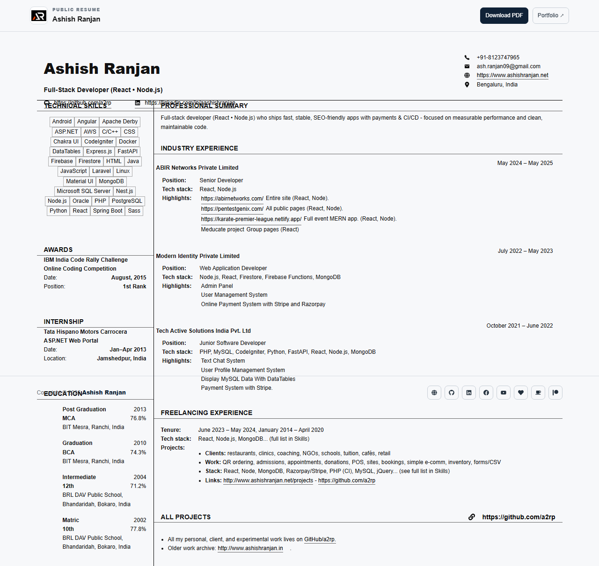

# Ashish Ranjan Resume

A responsive, public, versioned resume page with a downloadable PDF and links to professional work.



## Features

- Responsive resume layout for desktop and mobile screens.
- Fixed toolbar with local branding, portfolio link, and PDF download.
- Technical skills, education, experience, projects, and contact details.
- Print-friendly layout that hides the toolbar and footer.
- Icon-only social and support links in the footer.

## Tech stack

React, Vite, styled-components, CSS, and React Icons.

## Run locally

```bash
npm install
npm run dev
```

Build with `npm run build` and deploy with `npm run deploy`.

## Live

[Open the resume](https://a2rp.github.io/resume/)

[Download the PDF](https://a2rp.github.io/resume/downloads/Ashish_Ranjan_Resume.pdf)

## Links

- Portfolio: [https://www.ashishranjan.net](https://www.ashishranjan.net)
- GitHub: [https://github.com/a2rp](https://github.com/a2rp)
- CodePen: [https://codepen.io/ash1198](https://codepen.io/ash1198)
- LinkedIn: [https://www.linkedin.com/in/aashishranjan](https://www.linkedin.com/in/aashishranjan)
- Facebook: [https://www.facebook.com/theash.ashish/](https://www.facebook.com/theash.ashish/)
- YouTube: [https://www.youtube.com/@ashishranjan-ashz?sub_confirmation=1](https://www.youtube.com/@ashishranjan-ashz?sub_confirmation=1)
- Email: [ash.ranjan09@gmail.com](mailto:ash.ranjan09@gmail.com)

## Support

- Support: [https://a2rp-donation-page.netlify.app/](https://a2rp-donation-page.netlify.app/)
- Buy Me a Coffee: [https://buymeacoffee.com/a2rp](https://buymeacoffee.com/a2rp)
- Patreon: [https://patreon.com/a2rp](https://patreon.com/a2rp)
